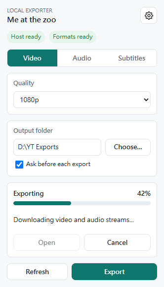
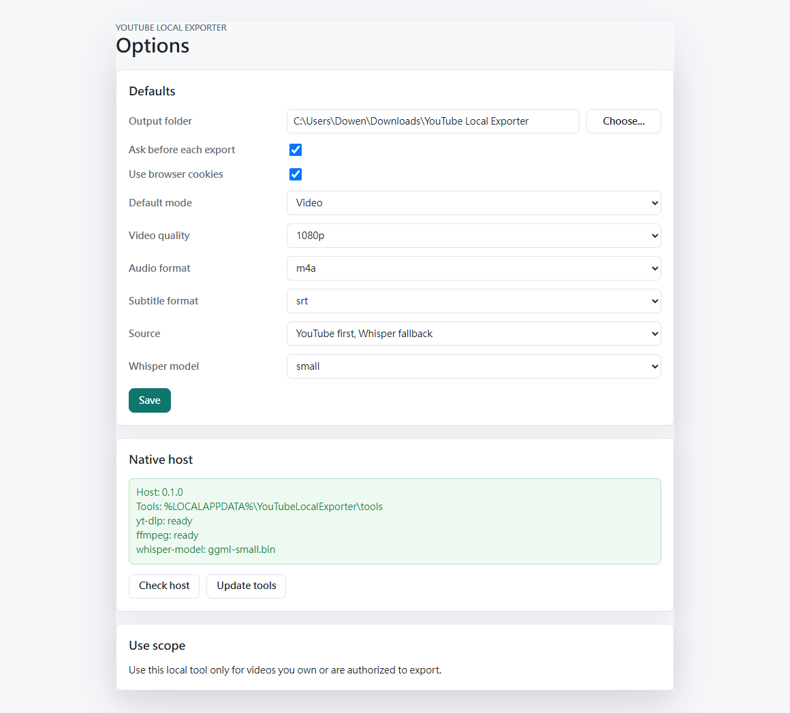

# YouTube Local Exporter

[](https://github.com/Tokenyet/youtube_local_exporter/actions/workflows/ci.yml)
[](https://github.com/Tokenyet/youtube_local_exporter/releases)
[](LICENSE)

Export authorized YouTube videos, audio, and subtitles from Chromium browsers to local files on Windows.

YouTube Local Exporter is a Manifest V3 extension plus a local native messaging host. The browser UI collects the current YouTube video and export settings; the native host runs `yt-dlp`, FFmpeg, and optional local Whisper transcription on your machine.

Use this only for videos you own or are authorized to export.

## Screenshots





## Features

- Export a YouTube video as MP4 with a selected maximum quality.
- Export audio as m4a, mp3, opus, wav, or best available.
- Export subtitles as SRT or VTT.
- Prefer YouTube subtitles and fall back to local Whisper when no subtitle track is available.
- Force local Whisper subtitle generation when you want fresh transcription.
- Pick an output folder per export or save a default folder.
- Keep generated media under your selected local folder.
- Store only extension preferences in `chrome.storage.sync`.

## Install From A Release

1. Download `youtube-local-exporter-vX.Y.Z-windows.zip` from [Releases](https://github.com/Tokenyet/youtube_local_exporter/releases).
2. Extract the ZIP.
3. Open `chrome://extensions`, `edge://extensions`, or your Chromium browser's extensions page.
4. Enable `Developer mode`.
5. Choose `Load unpacked`.
6. Select the extracted `extension` folder.
7. Copy the generated extension ID.
8. Open PowerShell in the extracted release folder and run:

```powershell
.\scripts\install-native.ps1 -ExtensionId <extension-id> -Browser chrome
.\scripts\update-tools.ps1
```

Use `-Browser edge`, `-Browser chromium`, `-Browser vivaldi`, or omit `-Browser` to register all supported browser registry paths.

Open a YouTube watch page, click the extension icon, choose an export mode and output folder, then start the export.

## Release Downloads

- `youtube-local-exporter-vX.Y.Z-windows.zip`: complete Windows sideload bundle. Start here.
- `youtube-local-exporter-extension-vX.Y.Z.zip`: extension-only runtime package for inspection or custom installation.
- `youtube-local-exporter-host-vX.Y.Z-windows-x64.exe`: standalone native host executable included in the Windows bundle.
- `SHA256SUMS.txt`: checksums for release downloads.

## Requirements

- Windows 10 or 11.
- Chrome, Edge, Chromium, or Vivaldi.
- PowerShell.
- Python 3.11 or newer if you install from source without the release-built native host executable.

`update-tools.ps1` downloads helper tools into `%LOCALAPPDATA%\YouTubeLocalExporter\tools`:

- `yt-dlp`
- Deno for yt-dlp JavaScript challenge solving
- FFmpeg and FFprobe
- whisper.cpp
- the selected Whisper model

## Install From Source

```powershell
git clone https://github.com/Tokenyet/youtube_local_exporter.git
cd youtube_local_exporter
.\scripts\package.ps1
```

Load this folder from your browser's extensions page:

```text
dist\unpacked\youtube-local-exporter
```

Copy the generated extension ID, then install the native messaging host:

```powershell
.\scripts\install-native.ps1 -ExtensionId <extension-id> -Browser chrome
.\scripts\update-tools.ps1
```

The source installer creates a `.cmd` launcher that runs the Python native host. To install a standalone executable instead:

```powershell
.\scripts\build-native.ps1
.\scripts\install-native.ps1 -ExtensionId <extension-id> -Browser chrome
```

When `native-host\dist\youtube-local-exporter-host.exe` exists, the installer copies and registers that executable.

## Privacy And Permissions

Media export jobs are processed locally by the native host. The extension does not collect analytics, send generated media to a remote service, or use cloud transcription.

Permissions:

- `activeTab`: reads the current tab only when you open the extension popup.
- `nativeMessaging`: talks to the local native host that performs exports.
- `storage`: stores extension preferences such as default folder, export mode, formats, and subtitle settings.
- `cookies`: optionally provides YouTube cookies to `yt-dlp` for videos your browser session is allowed to access.
- YouTube and Google host permissions: limited to YouTube pages and related Google authentication domains needed for authorized exports.

See [docs/PRIVACY.md](docs/PRIVACY.md) for the short privacy note.

## Development

Run validation:

```powershell
node --check src\background.js
node --check src\content.js
node --check popup\popup.js
node --check options\options.js
node scripts\smoke-test.mjs
python -m unittest discover -s native-host\tests
```

Package the extension runtime:

```powershell
.\scripts\package.ps1
```

Package release assets locally:

```powershell
.\scripts\build-native.ps1
.\scripts\package-release.ps1 -Version 0.1.0
```

## Release Workflow

CI runs on pushes and pull requests. The release workflow runs when a tag like `v0.1.0` is pushed, or manually from GitHub Actions with a version input.

```powershell
git tag v0.1.0
git push origin v0.1.0
```

The workflow validates the extension, builds the Windows native host executable, packages release downloads, writes checksums, and publishes a GitHub Release with notes from [CHANGELOG.md](CHANGELOG.md).

## Scope

This project is built for local sideload use. It is not a Chrome Web Store release target in v0.1.0. It does not support playlists, batch jobs, DRM bypassing, paywall bypassing, or cloud transcription.

## License

MIT. See [LICENSE](LICENSE).
